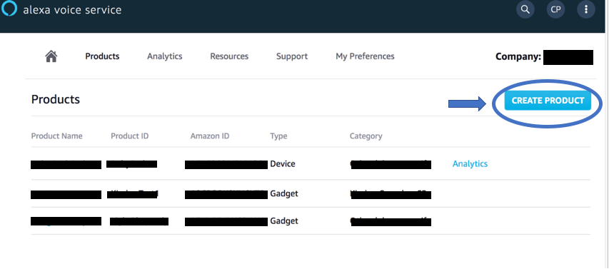
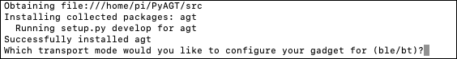
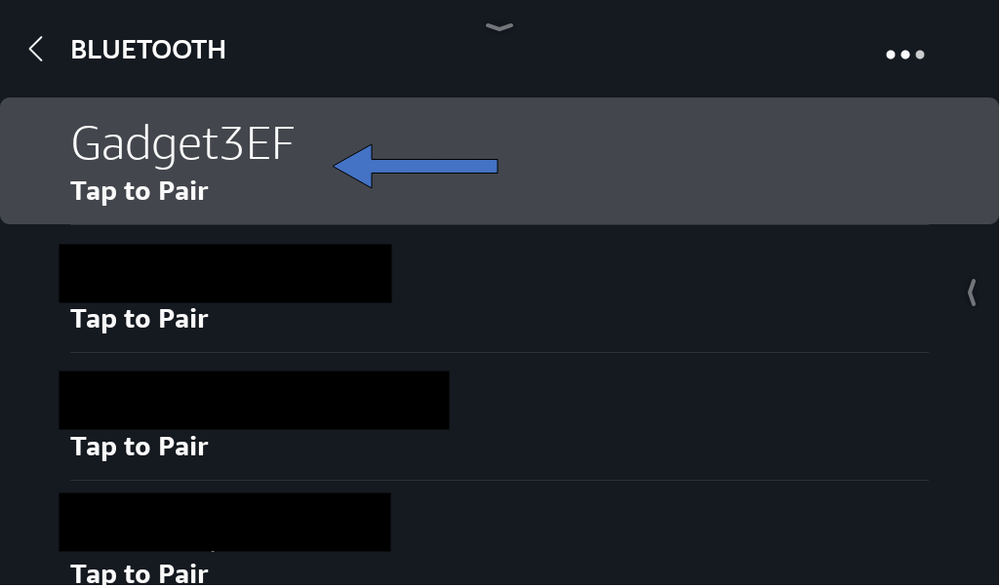
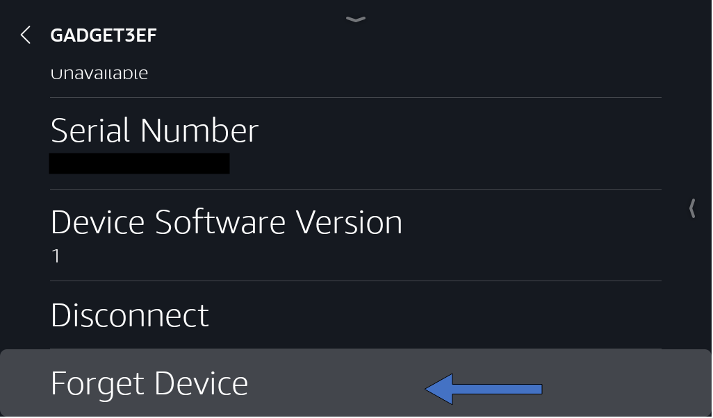

# Alexa Gadgets - Ignoring Alexa commands with wake word detection
> **WARNING**: NOT TESTED WITH WINDOWS 10

Create and Utilize an Alexa Gadget using a Raspberry Pi (preferred, can use a linux machine), Python, and the [Alexa Gadgets Toolkit](https://developer.amazon.com/alexa/alexa-gadgets).

For the rest of this tutorial, I'm going to be referencing the main linux machine as a "Raspberry Pi", but just know that it can be replaced with any linux machine
- [Projects](#projects)
- [Prerequisites](#prerequisites)
- [Registering a gadget in the AVS Developer Console](#registering-a-gadget-in-the-alexa-voice-service-developer-console)
- [Installation](#installation)
- [Creating a Virtual Environment](#installing-a-virtual-environment)
- [Configuration](#configuration)
- [Pairing your gadget to an Echo Device](#pairing-your-gadget-to-an-echo-device)
- [Troubleshooting guide](#troubleshooting-guide)
- [Running the example projects](#running-the-example-projects)
- [How does this work?](#how-does-this-work)


## Projects

- [Wake Word Gadget](src/examples/wakeword/): Create an Alexa Gadget that runs custom software when the wake word "Alexa" is detected


## Prerequisites

- [PREFERRED] Raspberry Pi 3 B+ ([Starter Kit](https://www.amazon.com/CanaKit-Raspberry-Complete-Starter-Premium/dp/B07BLRSKBV)) or later version that supports *Bluetooth 4.2* with an internet connection.
    or a Linux Machine: [download Linux Mint](https://www.linuxmint.com/download.php)
- An [Amazon Developer account](https://developer.amazon.com/alexa). If you don't already have a developer account, create one.
- An Echo device that is compatible with Alexa Gadgets meaning it must be able to utilize bluetooth connections. [Learn more](https://developer.amazon.com/docs/alexa-gadgets-toolkit/overview-bluetooth-gadgets.html#device-bluetooth-support)

## Registering a gadget in the Alexa Voice Service Developer Console

To create a gadget that works with your Echo device, you first need to register a new gadget in the [Alexa Voice Service Developer Console](https://developer.amazon.com/avs/home.html#/avs/home).

1. Sign in to the [Alexa Voice Service Developer Console](https://developer.amazon.com/avs/home.html#/avs/home). If you don't already have a developer account, create one.

    

2. If you haven't registered an AVS product in the past, click **GET STARTED**.

    

3. Click **PRODUCTS**, and then click **CREATE PRODUCT**.

    

4. Fill out the requested information, select **Alexa Gadget** as the product type, and then click **FINISH**.

    

5. In the pop-up, click **OK**.
6. You will be taken to a list of your products. Click on the gadget you just created.

    

7. At the top, you'll see an **Amazon ID** and **Alexa Gadget Secret**. You'll need these for the following steps to create your Alexa Gadget. Keep this ID and Secret private because they uniquely identify your gadget.

    

To learn more, refer to [Register a Gadget](https://developer.amazon.com/docs/alexa-gadgets-toolkit/register-gadget.html) in the Alexa Gadgets Toolkit documentation.

## Installation

To setup your Raspberry Pi/linux machine as an Alexa Gadget, you will need to download and install some Python and Debian packages. To run the following commands, you will need to be connected to your Pi via SSH or VNC, or be running them directly using a keyboard, mouse, and monitor connected to your Pi. Make sure your Pi is connected to the internet.

Download Alexa-Gadgets: Alexa-Consent repo from GitHub:

* **Using git clone:**
    - In your terminal:
        ```
        git clone https://github.com/alexa/Alexa-Gadgets-Raspberry-Pi-Samples.git
        ```

I have provided scripts for a more convenient setup and running the code. However all of the available commands can be found in the "launch.py" in the main "alexa-consent" folder.

### Installing a Virtual Environment 
>(OPTIONAL, but HIGHLY recommended)

I would highly recommend creating a virtual environment because we will be downloading python packages:

```
python3 -m pip install --user --upgrade pip
python3 -m pip install --user virtualenv
```
Now that that the pip is upgraded to the lastest version, we can then download virtualenv and activate our virtual env

To create a virtual env:
```
python3 -m venv <env-name>
```

To activate a virtual env: 
```
cd <env-name>
source bin/activate
```

To deactivate a virtual env:
```
deactivate
```


To setup your gadget, run the launch script with `--setup` argument, which will let you configure your gadget's credentials; install & update the libraries for Bluetooth, protobuf, interacting with GPIOs, etc; and configure the transport mode (Classic Bluetooth / BLE).

```
sudo python3 launch.py --setup
```
or alternatively
```
./setup.sh
```
> **Note:** Since the gadget needs a reliable Bluetooth connection with the Echo device, the A2DP Bluetooth profile will be disabled as part of the setup. If you would like to re-enable it please follow the **Troubleshooting guide** below.

If you already have registered your gadget using the **Registering a gadget in the Alexa Voice Service Developer Console** section, you can press `y` and enter your gadget's `Amazon ID` and `Alexa Gadget Secret` so that the setup script automatically configures all the examples with your gadget's credentials.


The Pi will update and install the Debian & Python dependencies. 

For the gadget to successfully communicate with your Echo device over BLE, a modification to the *bluez-5.50* is needed to enable notification callbacks after reconnection with a paired Echo device. The launch script will enable you to download the *bluez-5.50* package, modify it, and install it to your Pi.
To use **alexa-consent** you will need to read and agree to the **Terms and Conditions**. If you agree, enter *'AGREE'* else enter *'QUIT'* to quit the installation.


Once all the dependencies are installed, you will be asked to choose the transport mode to use to communicate with the Echo device.
You can enter *'BT'* if you would like to choose [Classic Bluetooth](https://developer.amazon.com/docs/alexa-gadgets-toolkit/overview-bluetooth-gadgets.html#classic-bluetooth), or you can enter *'BLE'* to choose [Bluetooth Low Energy](https://developer.amazon.com/docs/alexa-gadgets-toolkit/overview-bluetooth-gadgets.html#bluetooth-low-energy-beta).



Once the launch script configures the gadget based on the transport mode selected, a **SUCCESS** message will be printed.

> If you're using Pi in Desktop mode (using Pi with a display), you should disable the Pi Bluetooth menu to prevent two bluetooth clients (your gadget script and the Pi Bluetooth client) handling the bluetooth connections at the same time (which might lead to connectivity issues).
To disable the Pi Bluetooth menu right click on bluetooth icon on the top right of your screen, select *Remove "Bluetooth" From Panel* and reboot your Pi.
>
>

### Configuration
We need to edit the alexa_remote_control.sh file because we need to be able to connect to our alexa echo dot.

The file is located within 
```
...
|-- src
    |-- examples
        |-- wakeword
            |-- alexa_remote_control.sh
            |-- alexa_remote_wrapper.sh
            |-- wakeword.py
            |-- wakeword.ini
            ...
        ...
```
To edit the file run these commands within the /alexa-consent folder:
```
cd src/examples/wakeword
nano alexa_remote_control.sh
```

In the file, you need to edit the SET_EMAIL and SET_PASSWORD with the amazon account that you have linked to your amazon echo dot:
```
SET_EMAIL = <YOUR_AMAZON_EMAIL>
SET_PASSWORD = <YOUR_AMAZON_PASSWORD>
```

To test out if you are able to connect to your amazon echo dot, run this command to see a list of devices:
```
./alexa_remote_control -a
```

> **NOTE** If you experience a login error, a known workaround is to install a [cookies] (https://chrome.google.com/webstore/detail/cookiestxt/njabckikapfpffapmjgojcnbfjonfjfg?hl=en) extension and to manually login in to pitangui.amazon.com

After manually logging in, copy the cookies from the cookies.txt extension

Change your directory to:
```
cd /temp
```
and create this file:
```
nano .alexa.cookie
```
and then paste the cookie information to log in to alexa

Each gadget you create, including the examples, requires a configuration file that specifies the `Amazon ID` and `Alexa Gadget Secret` you created in the [Alexa Voice Service Developer Console]("https://developer.amazon.com/avs/home.html#/avs/home"), as well as a specification of the capabilities of your gadget.

If you haven't already initialized the AMAZON_ID and AMAZON_GADGET_SECERET via the ```./setup.sh``` or ```sudo python3 launch.py --setup``` commands then, you need to edit the wakeword.ini file directly:

```
[GadgetSettings]
amazonId = YOUR_GADGET_AMAZON_ID
alexaGadgetSecret = YOUR_GADGET_SECRET

[GadgetCapabilities]
Alexa.Gadget.StateListener = 1.0 - wakeword

```
The Wakeword example responds to the Alexa Gadget Toolkit capabilities that are available, which you can see listed. You can learn more about these capabilities in the [Alexa Gadgets Toolkit documentation](https://developer.amazon.com/docs/alexa-gadgets-toolkit/features.html).

The configuration file should either be:
- placed in the same folder as the python script and should have the same name as the python script;
for e.g. for the Wake word example, the name of the configuration file should be same (`wakeword.ini`) as the name of the python script (`wakeword.py`) and both should be placed in the same folder (`alexa-consent/src/examples/wakeword`).

> **Note:** You do not need to create new credentials for each new gadget you create, especially if you're just experimenting. As you refine your prototype, you may want to make sure that gadget has its own `Amazon ID` and `Alexa Gadget Secret` to avoid conflicts with other gadgets you create.


## Pairing your gadget to an Echo device

In order for a gadget you create to function, it will need to be paired to a [compatible Echo device](https://developer.amazon.com/docs/alexa-gadgets-toolkit/overview-bluetooth-gadgets.html#device-bluetooth-support). When running any example, make sure that the Echo device you want to pair to is nearby, and you have access to the Alexa app. The Echo devices that support gadgets are listed in the [Alexa Gadgets Toolkit documentation](https://developer.amazon.com/docs/alexa-gadgets-toolkit/understand-alexa-gadgets-toolkit.html#devices).

If your gadget has never been paired before or if you switched the transport mode, it will go into pairing mode when you run your gadget's Python code. Following are the steps to pair your gadget using the Kitchen Sink example:
- On your Pi, inside the `Alexa-Gadgets-Raspberry-Pi-Samples`, run the kitchen sink example using the launch script as follows:
    ```
    sudo python3 launch.py --example wakeword
    ```

    

When in pairing mode, you will see a note of your gadget's friendly name (e.g. **GadgetXYZ**) printed to the console. This name is what to look for when going through the following steps to pair your gadget to your Echo device.

### If you're using an Echo device without a screen

- In the Alexa app, navigate to your devices by tapping the **Devices** icon on the bottom right.

    

- Then tap **Echo & Alexa**.

    

- Then select your Echo device.

    

- In the settings of the Echo device, tap on the **Bluetooth Devices** option.

    

- Tap on **Pair a new Device**.

    

- Scroll through the list of devices to find the friendly name of your gadget. Be patient for it to show up.
- When the gadget's name shows up, tap on the name to initiate pairing.

    

- When your gadget is paired, you should see a new screen with a blue Bluetooth icon next to your gadget's name.
- In the command line, you should also see messages indicating that your gadget is paired.

    


### If you are using an Echo device with a screen

- Swipe down from the top of the screen, tap **Settings**.

    

- Then tap **Bluetooth**.

    

- You should see the friendly name of your gadget appear. Be patient for it to show up.
- When the gadget's name shows up, tap on the name to initiate pairing.

    

- When your gadget is paired, you should be able to see a *connected* message under your gadget's name.

    

- In the command line, you should also see messages indicating that your gadget is paired.

    

> If you face issues pairing or connecting your gadget with the Echo device, please follow the Troubleshooting guide below.

When your gadget connects to an Echo device, you will see a discovery response with information including the capabilities your gadget has registered to use.

> **Note:** If you're in Desktop mode on your Pi, and if you haven't disabled the Pi Bluetooth menu; while pairing your Pi with the Echo device, you might get a pop-up on your Pi that asks you to trust the device that's trying to connect. You can press OK or ignore the pop up by moving it aside.
If you press OK you might see the following error:
    
    This error is generated by the Pi Bluetooth menu as the A2DP Bluetooth profile is disabled to ensure stable connectivity with the Echo device. The gadget will pair successfully even if you see this error, so you can press OK or ignore the pop up by moving it aside. We strongly recommend disabling the Pi Bluetooth menu by following the instructions at the bottom of the **Installation** section, to ensure that only your gadget script handles the Bluetooth connection with your Echo device.

### Disconnecting your gadget

To disconnect your gadget, just terminate the launch script using `CTRL + C`. The gadget will disconnect and the script will terminate in a few seconds.


### Re-pairing your gadget

To re-pair your gadget with the same or different Echo device, you can put your gadget in pairing mode again by adding the `--pair` argument to the command to run the Python code. For example: `sudo python3 launch.py kitchen_sink --pair`.

If you are pairing to a previously paired Echo device, please ensure that you first forget the gadget from the Echo device using the instructions in the **Forgetting your gadget from Echo device** section.

### Unpairing your gadget

When you pair your Pi to an Echo device, the Bluetooth address for the Echo device is stored in a JSON file named `.agt.json` at `/src/`. You can manually clear this Bluetooth address as well as the Bluetooth bond with the Echo device by using the `--clear` argument. For example: `sudo python3 launch.py --example kitchen_sink --clear`.

You are also required to unpair the gadget from your Echo device using the steps listed below.

### Forgetting your gadget from Echo device
#### If you're using an Echo device without a screen
- In the Alexa app, navigate to your devices by tapping the **Devices** icon on the bottom right. Then tap **Echo & Alexa**, and select your Echo device.
- In the settings of the Echo device, tap on the **Bluetooth Devices**.

    

- Then tap on the drop-down arrow on the right side of the gadget you want unpair, and then tap on **Forget Device**.

    

#### If you are using an Echo device with a screen

- Swipe down from the top of the screen, tap **Settings**, and then tap **Bluetooth**.
- You should see the friendly name of your gadget, tap on the information symbol next to your gadget.

    

- Then tap on **Forget Device**.

    

## Switching Transport mode

To switch the transport mode used by your gadget to communicate with the Echo device, you will need to use the following instructions:
* Execute the launch script in setup mode
    ```
    sudo python3 launch.py --setup
    ```
* Answer *'y'* or *'n'* for re-configuring the gadget credentials based on your preference.
* Based on the currently configured transport mode, the script will ask you if you would like to switch from BT to BLE or vice versa. Enter *'y'* to switch the transport mode of your gadget.
* If you switch the transport mode, the script will prompt you to unpair the gadget from your Echo device. Follow the instructions in **Forgetting your gadget from Echo device** section to unpair your gadget from the Echo device and press *ENTER*.
* The script then will clear your Echo device's pairing bond from the gadget and terminate with the **SUCCESS** message.

    

* Run any example to pair the gadget to your Echo device over the new transport mode using the instructions in **Pairing your gadget to an Echo device** section.

## Troubleshooting guide
* If your gadget pairs, but fails to connect, stop the Python script by pressing `CTRL + C`, and run it again:
`sudo python3 launch.py --example wakeword`.
* If your gadget fails to pair or needs to re-paired:
    * Forget your gadget from the Echo device using the above **Forgetting your gadget from Echo device** instructions.
    * On the gadget, stop the Python script (if it is running) by pressing `CTRL + C`, and run it again with the clear argument to put it in the pairing mode using the `--pair` argument:
    `sudo python3 launch.py --example wakeword --pair`
    * Follow the instructions in **Pairing your gadget to an Echo device** to pair your gadget again to the Echo device.

* As part of the setup script, the A2DP Bluetooth profile is disabled. If you would like to re-enable it, execute the following commands in the terminal:
    ```
    sudo apt-get -y install bluealsa
    sudo reboot
    ```
    >**Note:** We strongly recommend that the A2DP Bluetooth profile is disabled to ensure stable gadget connectivity with the Echo device. To disable it again run the setup script mentioned in the **Installation** section.

* You can also check out the [list of known issues](https://developer.amazon.com/docs/alexa-gadgets-toolkit/known-issues.html#bluetooth) associated with the Alexa Gadgets Toolkit.


## Running the example projects

To run a gadget example you can use the included launch script with *--example* argument as follows:
```
./run_wakeword.sh
```
or alternatively you can use

```
sudo python3 launch.py --example wakeword 
```

The `example_name` defines the name of the example located in the `/home/pi/alexa-consent/src/examples` folder.
For the launch script to be able to correctly identify your example using the `example_name`, the names of the example folder and the script (along with its *.ini* [config](#configuration) file) should have the same name.

For e.g. the folder structure for the wakeword example looks as follows:
```
...
|-- examples
    |-- wakeword
        |-- wakeword.py
        |-- wakeword.ini
        ...
    ...
```

## How does this work?

This Python software enables the creation of an Alexa Gadget by handling the connection of the gadget to an Echo device over Classic Bluetooth or Bluetooth Low Energy, and responding to messages based on the Alexa Gadget Toolkit capabilities you specify.

### Callbacks

Each example project leverages callbacks that have been provided for responding to the capabilities that your gadget is configured to respond to.

You can see an example of these callbacks in the wake-word gadget within the `alexa-consent/src/examples/wakeword/wakeword.py` Python file, including:

``` python
def on_alexa_gadget_statelistener_stateupdate(self, directive):
    '''
    CUSTOM CODE, that listens to the "active" status of the alexa echo dot
    '''
```


This is a personal project that is an extension of the Alexa Gadgets Tutorial Sample Projects found on: https://github.com/alexa/Alexa-Gadgets-Raspberry-Pi-Samples
